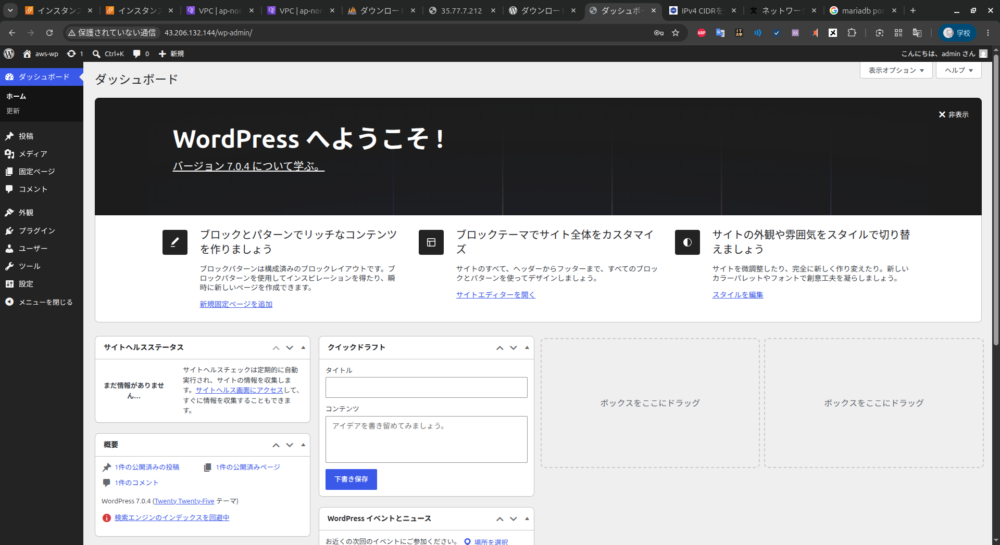
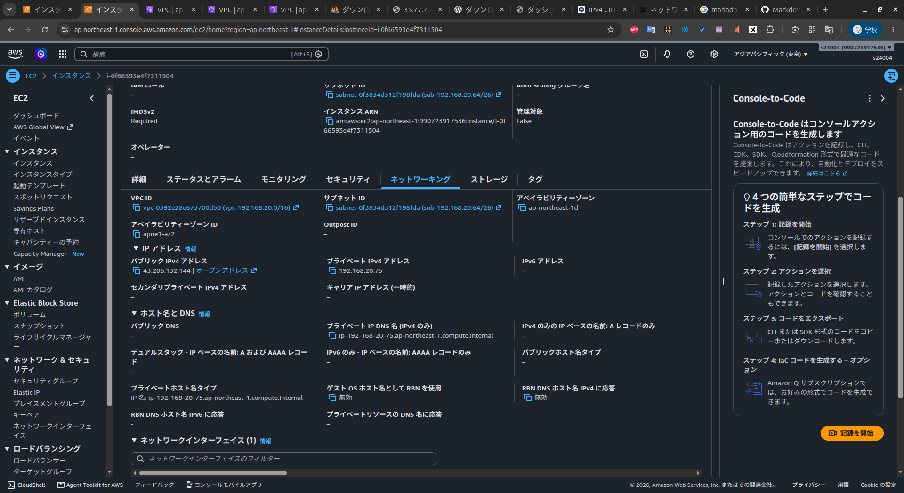
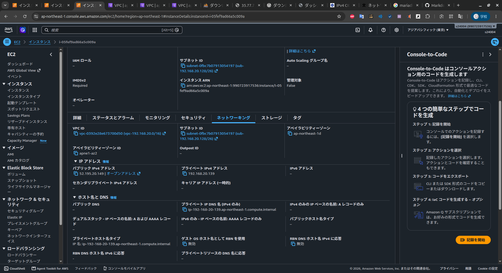

# AWS Final Exam 2026 

以下の条件に従い，Wordpressシステムを構築せよ，データベース作成のサンプルSQLを参考のため下に記す

## 条件

1. VPCのネットワークは 192.168.20.0/24 とする
2. 上記ネットワークを4つに分割し2番めのサブネットワークをPublic,3番めのネットワークをPrivateとして構築する
3. Publicネットワーク上に踏み台サーバとWebサーバを構築しインターネットから踏み台サーバのSSH, WebサーバのWebアクセスを可能にする
4. Privateネットワークにデータベースを構築し，Webサーバからのデータベースアクセスだけを可能にする(データベースはAWSのDBが望ましい)
5. Webサーバ上にWordpressシステムを構築し，管理者としてログインしてダッシュボード画面のスクリーンショットを提出する

database作成 サンプルコマンド

```sql
# データベース作成
CREATE DATABASE wordpress DEFAULT CHARACTER SET utf8 COLLATE utf8_general_ci;

# 権限割当
grant all on wordpress.* to wordpress@"%" identified by 'wordpress_aghjkl';

# 権限適用
flash previleges;
```

### 問1 踏み台サーバ，Webサーバ，DBサーバのLocalIPアドレスを記せ(RDSの場合はendpoint)

```md
踏み台サーバIP:192.168.20.74
WebサーバIP:  192.168.20.75
DBサーバIP:   192.168.20.139
              192.168.20.138(ミス)
```

### 問2 Public, Private ネットワークのルーティングテーブルをすべて記せ

2.1 Publicネットワークのルートテーブルを記せ

```md
0.0.0.0/0       igw-04fe3a8e7bdb64d75
192.168.20.0/24 local

```

2.2 Privateネットワークのルートテーブルを記せ

```md
0.0.0.0/0       nat-061108bcb6c161b67
192.168.20.0/24 local

```

### 問3 踏み台サーバ，Webサーバ，DBサーバのファイウォール(セキュリティグループ)の設定をすべて記せ

3.1 踏み台サーバの許可ルール (ネットワーク範囲, ポート番号)

```md
0.0.0.0/0   22

```

3.2 Webサーバの許可ルール (ネットワーク範囲, ポート番号)

```md
0.0.0.0/0           80
192.168.20.74/32    22

```

3.3 DBサーバの許可ルール (ネットワーク範囲, ポート番号)

```md
192.168.20.75/32    3306
192.168.20.74/32    22

```

### 問4 以下のスクリーンショットを取得して提出せよ

1. blogの管理画面の[設定]

2. WebサーバのIP設定(ip a)画面

3. DBサーバのIP設定画面(AWS RDSの場合はその設定画面)


### 問5 この講義を受けて学んだことを200字程度にまとめて記せ

```md
ここに記述


```
