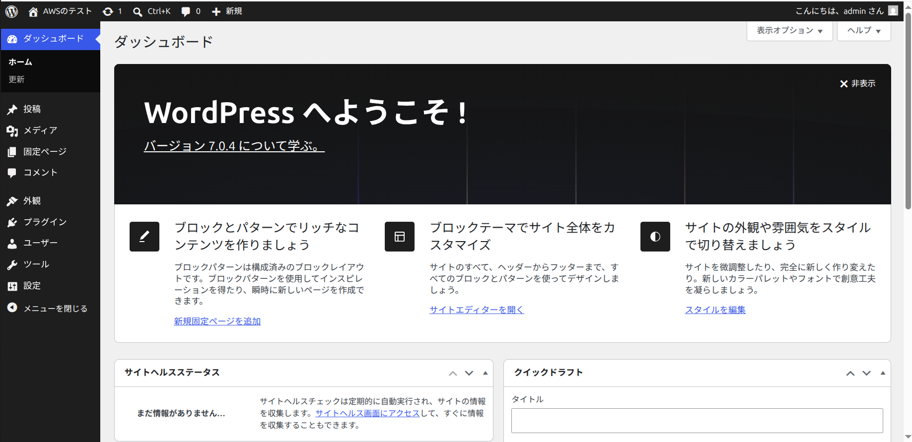
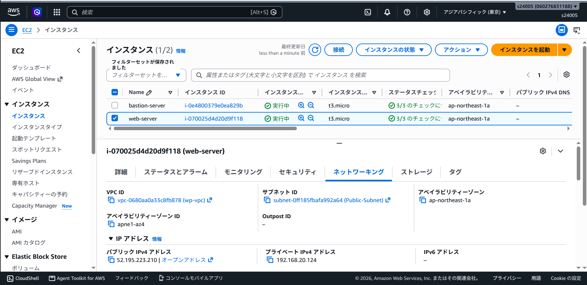
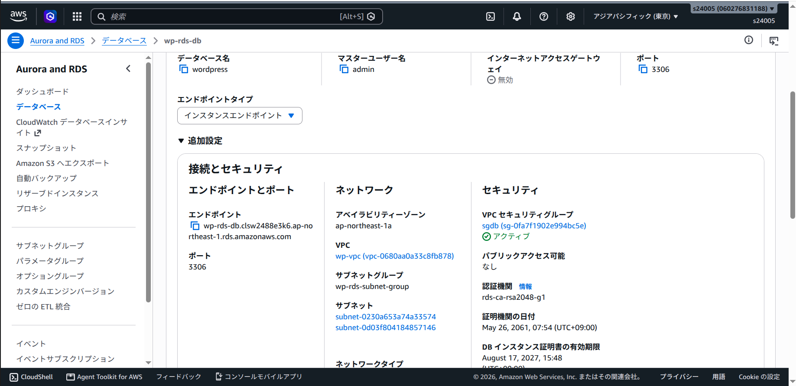

# AWS Final Exam 2026 

以下の条件に従い，Wordpressシステムを構築せよ，データベース作成のサンプルSQLを参考のため下に記す

## 条件

1. VPCのネットワークは 192.168.20.0/24 とする
2. 上記ネットワークを4つに分割し2番めのサブネットワークをPublic,3番めのネットワークをPrivateとして構築する
3. Publicネットワーク上に踏み台サーバとWebサーバを構築しインターネットから踏み台サーバのSSH, WebサーバのWebアクセスを可能にする
4. Privateネットワークにデータベースを構築し，Webサーバからのデータベースアクセスだけを可能にする(データベースはAWSのDBが望ましい)
5. Webサーバ上にWordpressシステムを構築し，管理者としてログインしてダッシュボード画面のスクリーンショットを提出する

database作成 サンプルコマンド

```sql
# データベース作成
CREATE DATABASE DB名 DEFAULT CHARACTER SET utf-8 COLLATE utf8_general_ci;

# 権限割当
grant all on DB名.* to ユーザー名@"%" identified by パスワード;

# 権限適用
flash previleges;
```

### 問1 踏み台サーバ，Webサーバ，DBサーバのLocalIPアドレスを記せ(RDSの場合はendpoint)

```md
踏み台サーバIP:  13.115.10.71
WebサーバIP:  52.195.223.210
DBサーバIP:   wp-rds-db.clsw2488e3k6.ap-northeast-1.rds.amazonaws.com
```

### 問2 Public, Private ネットワークのルーティングテーブルをすべて記せ

2.1 Publicネットワークのルートテーブルを記せ

```md
送信先:
192.168.20.0/24

ターゲット:
local

関連付けるサブネット:
Public-Subnet (192.168.20.64/26)

```

2.2 Privateネットワークのルートテーブルを記せ

```md
送信先:
192.168.20.0/24

ターゲット:
local

関連付けるサブネット:
Private-Subnet-1 (192.168.20.128/26)
Private-Subnet-2 (192.168.20.192/26)

```

### 問3 踏み台サーバ，Webサーバ，DBサーバのファイウォール(セキュリティグループ)の設定をすべて記せ

3.1 踏み台サーバの許可ルール (ネットワーク範囲, ポート番号)

```md
インバウンド:
SSH

ソース:
マイ IP

ポート番号:
TCP/22

```

3.2 Webサーバの許可ルール (ネットワーク範囲, ポート番号)

```md
インバウンド:
HTTP

ソース:
Anywhere (0.0.0.0/0)

ポート番号:
TCP / 80


インバウンド:
SSH

ソース:
sg-bastion（踏み台SG

ポート番号:
TCP / 22

```

3.3 DBサーバの許可ルール (ネットワーク範囲, ポート番号)

```md
インバウンド:
MySQL/Aurora

ソース:
sg-web（WebサーバーSG）

ポート番号:
TCP / 3306

```

### 問4 以下のスクリーンショットを取得して提出せよ

1. blogの管理画面の[設定]


2. WebサーバのIP設定(ip a)画面


3. DBサーバのIP設定画面(AWS RDSの場合はその設定画面)


### 問5 この講義を受けて学んだことを200字程度にまとめて記せ

```md
ここに記述


```
