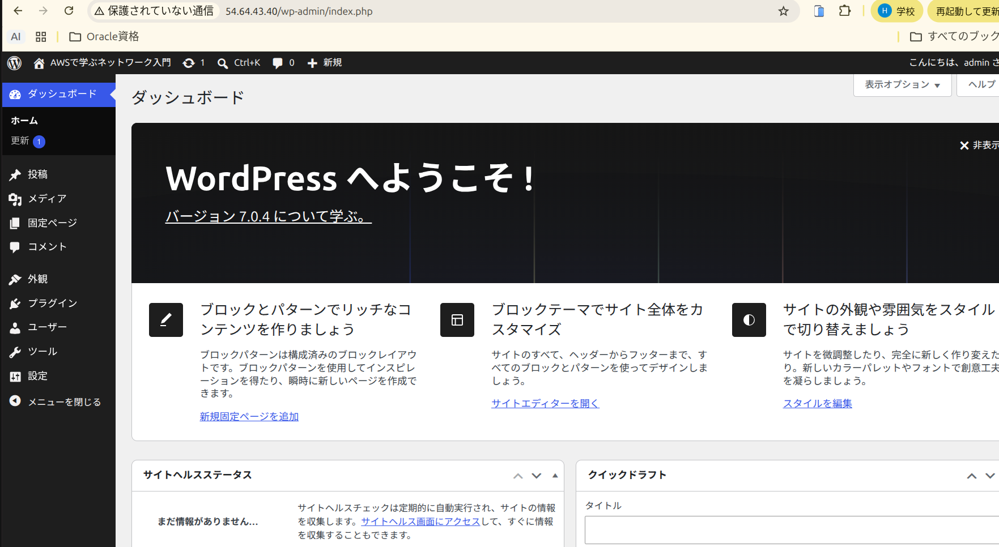
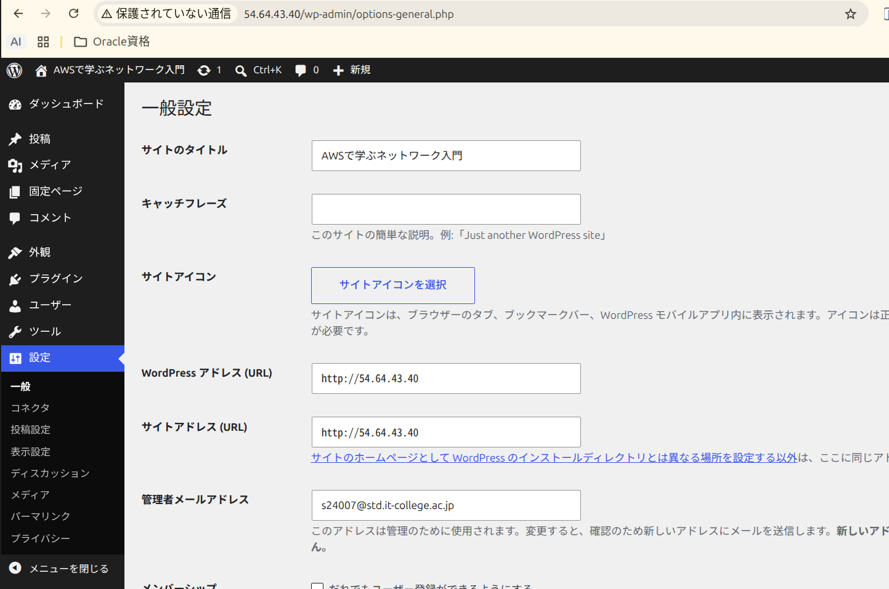
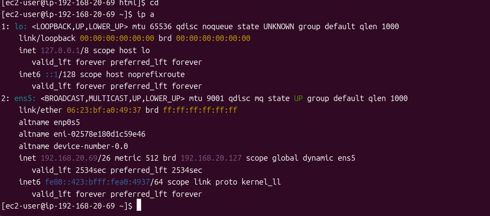
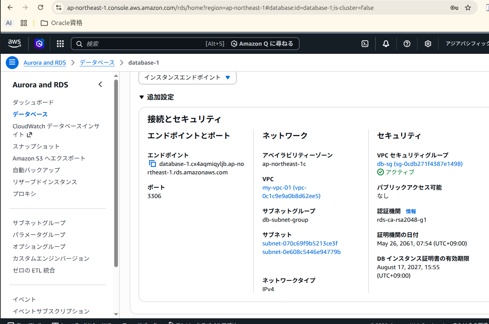

# AWS Final Exam 2026 

以下の条件に従い，Wordpressシステムを構築せよ，データベース作成のサンプルSQLを参考のため下に記す

## 条件

1. VPCのネットワークは 192.168.20.0/24 とする
2. 上記ネットワークを4つに分割し2番めのサブネットワークをPublic,3番めのネットワークをPrivateとして構築する
3. Publicネットワーク上に踏み台サーバとWebサーバを構築しインターネットから踏み台サーバのSSH, WebサーバのWebアクセスを可能にする
4. Privateネットワークにデータベースを構築し，Webサーバからのデータベースアクセスだけを可能にする(データベースはAWSのDBが望ましい)
5. Webサーバ上にWordpressシステムを構築し，管理者としてログインしてダッシュボード画面のスクリーンショットを提出する

database作成 サンプルコマンド

```sql
# データベース作成
CREATE DATABASE DB名 DEFAULT CHARACTER SET utf-8 COLLATE utf8_general_ci;

# 権限割当
grant all on DB名.* to ユーザー名@"%" identified by パスワード;

# 権限適用
flash previleges;
```

### 条件5 Wordpress管理者ダッシュボード画面



Webサーバ上に構築したWordPressに管理者(admin)としてログインした
ダッシュボード画面。URLは http://54.64.43.40/wp-admin/index.php であり、
Publicサブネット上のWebサーバでWordPressが稼働していることを示している。
データベースはPrivateサブネット上のRDS(MySQL)を使用している。

### 問1 踏み台サーバ，Webサーバ，DBサーバのLocalIPアドレスを記せ(RDSの場合はendpoint)

```md
踏み台サーバIP:192.168.20.68
WebサーバIP:  192.168.20.69
DBサーバIP:   database-1.cx4aqmiqyljb.ap-northeast-1.rds.amazonaws.com (RDS endpoint)
```

### 問2 Public, Private ネットワークのルーティングテーブルをすべて記せ

2.1 Publicネットワークのルートテーブルを記せ

対象サブネット: 192.168.20.64/26 (Public)

```md
送信先(Destination)      ターゲット(Target)
192.168.20.0/24          local
0.0.0.0/0                igw-01f4d6fa81d1c8601 (インターネットゲートウェイ)
```

192.168.20.0/24 宛は local ルートによりVPC内部で転送され、
それ以外の宛先(0.0.0.0/0)はインターネットゲートウェイ経由で
インターネットへ転送される。これによりインターネットからの
SSH/HTTPアクセスが可能となる。

2.2 Privateネットワークのルートテーブルを記せ

対象サブネット: 192.168.20.128/26 (Private)
        および 192.168.20.192/26 (RDSのサブネットグループ要件により作成)

```md
送信先(Destination)      ターゲット(Target)
192.168.20.0/24          local
```

local ルートのみでインターネットゲートウェイへのルートを持たない。
そのためインターネットとの通信は不可であり、同一VPC内
(Webサーバ 192.168.20.69 等)からのアクセスのみ可能である。

なおRDSはDBサブネットグループに2つ以上のアベイラビリティゾーンの
サブネットが必要なため、192.168.20.192/26 も作成している。
実際のDBインスタンスは 192.168.20.226 に配置されている。

### 問3 踏み台サーバ，Webサーバ，DBサーバのファイウォール(セキュリティグループ)の設定をすべて記せ

3.1 踏み台サーバの許可ルール (ネットワーク範囲, ポート番号)

セキュリティグループ名: bastion-sg

```md
[インバウンド]
タイプ   プロトコル  ポート  ソース         用途
SSH      TCP         22      0.0.0.0/0      インターネットからのSSH接続

[アウトバウンド]
すべてのトラフィック  All  All  0.0.0.0/0  (デフォルト)
```

3.2 Webサーバの許可ルール (ネットワーク範囲, ポート番号)

セキュリティグループ名: web-sg

```md
[インバウンド]
タイプ   プロトコル  ポート  ソース                用途
HTTP     TCP         80      0.0.0.0/0             インターネットからのWebアクセス
SSH      TCP         22      bastion-sg     踏み台サーバからのSSH接続のみ許可

[アウトバウンド]
すべてのトラフィック  All  All  0.0.0.0/0  (デフォルト)
```

SSHのソースにIPアドレスではなく踏み台のセキュリティグループを指定することで、
インターネットから直接WebサーバへSSH接続することはできず、
必ず踏み台サーバを経由する構成としている。

3.3 DBサーバの許可ルール (ネットワーク範囲, ポート番号)

セキュリティグループ名: db-sg

```md
[インバウンド]
タイプ          プロトコル  ポート  ソース          用途
MYSQL/Aurora    TCP         3306    web-sg   Webサーバからのみ接続を許可

[アウトバウンド]
すべてのトラフィック  All  All  0.0.0.0/0  (デフォルト)
```

ソースをWebサーバのセキュリティグループのみに限定しているため、
踏み台サーバやインターネットからDBへ接続することはできない。
またRDSはパブリックアクセスを「なし」に設定している。

### 問4 以下のスクリーンショットを取得して提出せよ

1. blogの管理画面の[設定]
2. WebサーバのIP設定(ip a)画面
3. DBサーバのIP設定画面(AWS RDSの場合はその設定画面)

#### 4.1 blogの管理画面の[設定]



WordPressの「設定 > 一般設定」画面。WordPressアドレスおよびサイトアドレスが
Webサーバのパブリックアドレス http://54.64.43.40 となっていることを確認できる。

#### 4.2 WebサーバのIP設定 (ip a)



Webサーバ上で `ip a` を実行した結果。インターフェイス ens5 に
Publicサブネット内のプライベートアドレス 192.168.20.69/26 が
割り当てられている。ネットマスクが /26 であることから、
192.168.20.0/24 を4分割したサブネットであることが確認できる。

#### 4.3 DBサーバ(RDS)の設定画面



RDSインスタンス database-1 の「接続とセキュリティ」画面。
- エンドポイント: database-1.cx4aqmiqyljb.ap-northeast-1.rds.amazonaws.com
- ポート: 3306
- アベイラビリティーゾーン: ap-northeast-1c
- VPC: my-vpc-01
- VPCセキュリティグループ: db-sg
- パブリックアクセス可能: **なし**

パブリックアクセスを「なし」とし、セキュリティグループを db-sg に
限定することで、インターネットおよび踏み台サーバからは接続できず、
Webサーバからのみ接続可能な構成となっている。

### 問5 この講義を受けて学んだことを200字程度にまとめて記せ

```md
本講義では、AWS上でネットワークからアプリケーションまでを一貫して構築する
手順を学んだ。VPCを/26に4分割し、インターネットゲートウェイへのルートの
有無だけでPublicとPrivateが決まることを理解した。セキュリティグループでは
送信元に別のセキュリティグループを指定でき、踏み台経由のSSHやWebサーバ
からのみのDB接続など、必要最小限の通信だけを許可できると分かった。また
DB接続がSSL必須で失敗した際は、エラーメッセージから原因を切り分ける
大切さも実感した。
```
