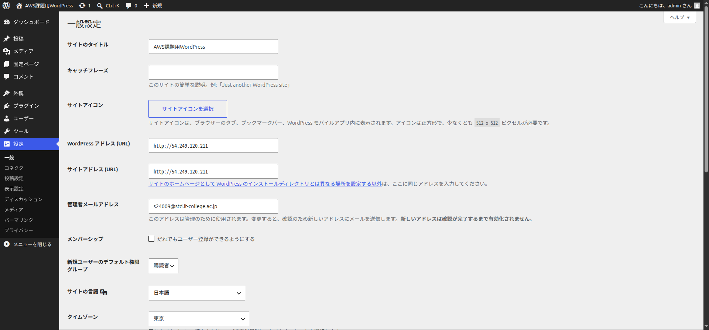
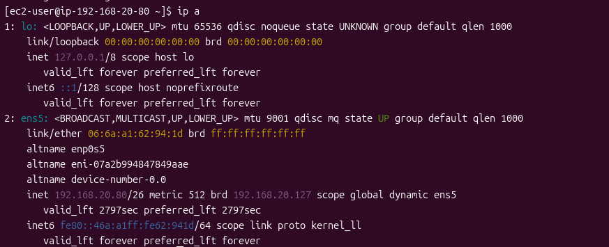
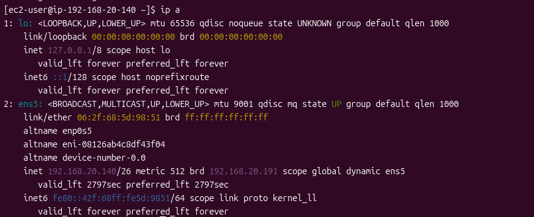

# AWS Final Exam 2026 

以下の条件に従い，Wordpressシステムを構築せよ，データベース作成のサンプルSQLを参考のため下に記す

## 条件

1. VPCのネットワークは 192.168.20.0/24 とする
2. 上記ネットワークを4つに分割し2番めのサブネットワークをPublic,3番めのネットワークをPrivateとして構築する
3. Publicネットワーク上に踏み台サーバとWebサーバを構築しインターネットから踏み台サーバのSSH, WebサーバのWebアクセスを可能にする
4. Privateネットワークにデータベースを構築し，Webサーバからのデータベースアクセスだけを可能にする(データベースはAWSのDBが望ましい)
5. Webサーバ上にWordpressシステムを構築し，管理者としてログインしてダッシュボード画面のスクリーンショットを提出する

database作成 サンプルコマンド

```sql
# データベース作成
CREATE DATABASE DB名 DEFAULT CHARACTER SET utf-8 COLLATE utf8_general_ci;

# 権限割当
grant all on DB名.* to ユーザー名@"%" identified by パスワード;

# 権限適用
flash previleges;
```

### 問1 踏み台サーバ，Webサーバ，DBサーバのLocalIPアドレスを記せ(RDSの場合はendpoint)

```md
踏み台サーバIP: 192.168.20.70
WebサーバIP:   192.168.20.80
DBサーバIP:    192.168.20.140
```

### 問2 Public, Private ネットワークのルーティングテーブルをすべて記せ

2.1 Publicネットワークのルートテーブルを記せ

```md
送信先: 192.168.20.0/24 | ターゲット: local
送信先: 0.0.0.0/0        | ターゲット: インターネットゲートウェイ
```

2.2 Privateネットワークのルートテーブルを記せ

```md
送信先: 192.168.20.0/24 | ターゲット: local
送信先: 0.0.0.0/0        | ターゲット: NATゲートウェイ
```

### 問3 踏み台サーバ，Webサーバ，DBサーバのファイウォール(セキュリティグループ)の設定をすべて記せ

3.1 踏み台サーバの許可ルール (ネットワーク範囲, ポート番号)

```md
・SSH
  ネットワーク範囲: 0.0.0.0/0
  ポート番号: 22 (TCP)
```

3.2 Webサーバの許可ルール (ネットワーク範囲, ポート番号)

```md
・HTTP
  ネットワーク範囲: 0.0.0.0/0
  ポート番号: 80 (TCP)

・SSH
  ネットワーク範囲:192.168.20.70/32
  ポート番号: 22 (TCP)
```

3.3 DBサーバの許可ルール (ネットワーク範囲, ポート番号)

```md
・MySQL / Aurora
  ネットワーク範囲: 192.168.20.80/32
  ポート番号: 3306 (TCP)

・SSH (管理用)
  ネットワーク範囲: 192.168.20.70/32
  ポート番号: 22 (TCP)
```

### 問4 以下のスクリーンショットを取得して提出せよ

#### 1. blogの管理画面の[設定]


#### 2. WebサーバのIP設定(ip a)画面


#### 3. DBサーバのIP設定画面

### 問5 この講義を受けて学んだことを200字程度にまとめて記せ

```md
初めてのAWSだったが、実際に手を動かしてネットワークを構築することで理解を深められた。
サブネットを分割して重要なDBを外部から隔離し、セキュリティグループを使ったり、踏み台サーバを用意するなど、サーバーを安全に保護する設計の基礎を体験できた。
座学だけではイメージしづらかったルーティングや通信の流れを実感でき、Webシステムを動かすインフラの基礎を学べた。
```
