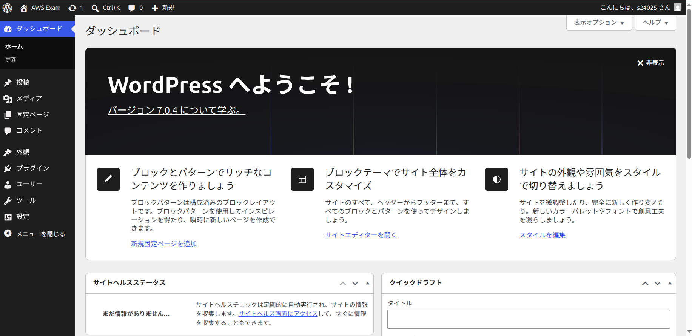
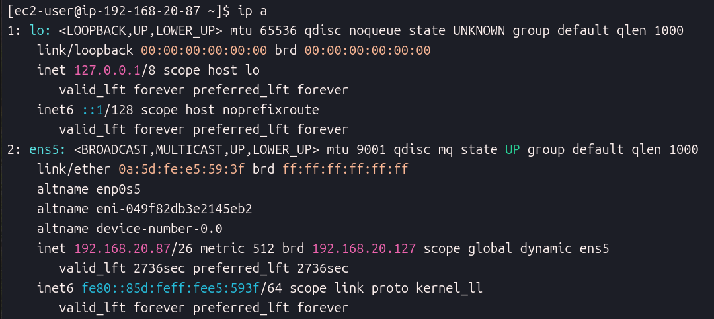
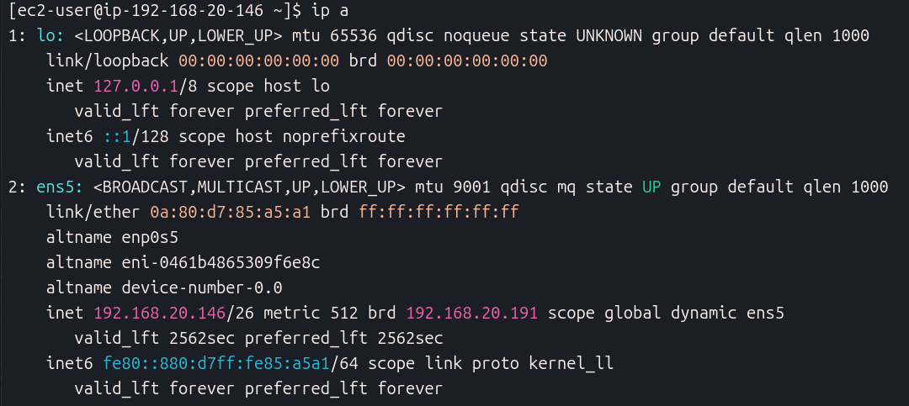

# AWS Final Exam 2026 

以下の条件に従い，Wordpressシステムを構築せよ，データベース作成のサンプルSQLを参考のため下に記す

## 条件

1. VPCのネットワークは 192.168.20.0/24 とする
2. 上記ネットワークを4つに分割し2番めのサブネットワークをPublic,3番めのネットワークをPrivateとして構築する
3. Publicネットワーク上に踏み台サーバとWebサーバを構築しインターネットから踏み台サーバのSSH, WebサーバのWebアクセスを可能にする
4. Privateネットワークにデータベースを構築し，Webサーバからのデータベースアクセスだけを可能にする(データベースはAWSのDBが望ましい)
5. Webサーバ上にWordpressシステムを構築し，管理者としてログインしてダッシュボード画面のスクリーンショットを提出する

database作成 サンプルコマンド

```sql
# データベース作成
CREATE DATABASE DB名 DEFAULT CHARACTER SET utf-8 COLLATE utf8_general_ci;

# 権限割当
grant all on DB名.* to ユーザー名@"%" identified by パスワード;

# 権限適用
flash previleges;
```

### 問1 踏み台サーバ，Webサーバ，DBサーバのLocalIPアドレスを記せ(RDSの場合はendpoint)

```md
踏み台サーバIP:192.168.20.75
WebサーバIP:  192.168.20.87
DBサーバIP:   192.168.20.146
```

### 問2 Public, Private ネットワークのルーティングテーブルをすべて記せ

2.1 Publicネットワークのルートテーブルを記せ

```md
名前: Public-RT
ルート設定:
送信先: 192.168.20.0/24 -> ターゲット: local
送信先: 0.0.0.0/0 -> ターゲット: igw-064a00a0b8fa35e3f

```

2.2 Privateネットワークのルートテーブルを記せ

```md
名前: Private-RT
ルート設定:
送信先: 192.168.20.0/24 -> ターゲット: local
送信先: 0.0.0.0/0 -> ターゲット: nat-0e34f6243e9069ed7

```

### 問3 踏み台サーバ，Webサーバ，DBサーバのファイウォール(セキュリティグループ)の設定をすべて記せ

3.1 踏み台サーバの許可ルール (ネットワーク範囲, ポート番号)

```md
SSH (ポート 22): インバウンド許可 0.0.0.0/0


```

3.2 Webサーバの許可ルール (ネットワーク範囲, ポート番号)

```md
HTTP (ポート 80): インバウンド許可 0.0.0.0/0
SSH (ポート 22): インバウンド許可 192.168.20.75/32

```

3.3 DBサーバの許可ルール (ネットワーク範囲, ポート番号)

```md
MySQL/Aurora (ポート 3306): インバウンド許可 192.168.20.87/32
SSH (ポート 22): インバウンド許可 192.168.20.75/32

```

### 問4 以下のスクリーンショットを取得して提出せよ

1. blogの管理画面の[設定]

(./wp-admin.setting.png)
3. WebサーバのIP設定(ip a)画面

4. DBサーバのIP設定画面(AWS RDSの場合はその設定画面)


### 問5 この講義を受けて学んだことを200字程度にまとめて記せ

```md
本講義を通して、AWS上のVPC構築からサブネット分割、セキュリティグループによるアクセス制御の重要性を学びました。また、踏み台サーバーを経由した3層アーキテクチャの構築をすることが出来たので、この知識を活かしてセキュリティを意識したインフラ構築を目指したいです。
CIDRを使ったサブネット分割の計算や設定が苦戦したため、今後さらに理解を深めてスムーズに設計できるように頑張りたいです。

```
