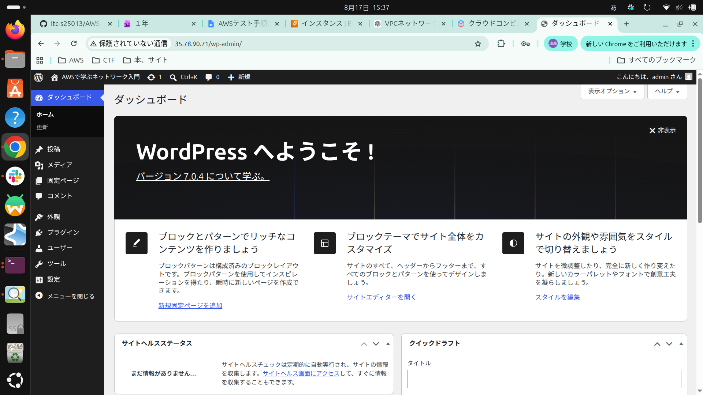
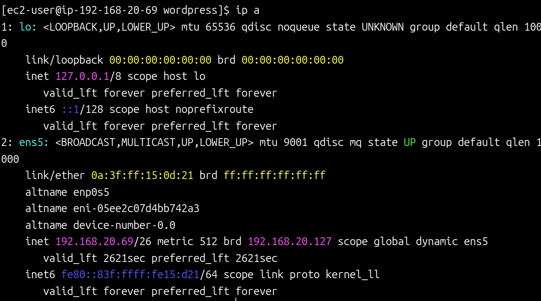
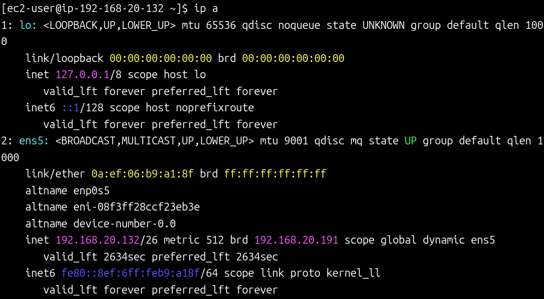

# AWS Final Exam 2026 

以下の条件に従い，Wordpressシステムを構築せよ，データベース作成のサンプルSQLを参考のため下に記す

## 条件

1. VPCのネットワークは 192.168.20.0/24 とする
2. 上記ネットワークを4つに分割し2番めのサブネットワークをPublic,3番めのネットワークをPrivateとして構築する
3. Publicネットワーク上に踏み台サーバとWebサーバを構築しインターネットから踏み台サーバのSSH, WebサーバのWebアクセスを可能にする
4. Privateネットワークにデータベースを構築し，Webサーバからのデータベースアクセスだけを可能にする(データベースはAWSのDBが望ましい)
5. Webサーバ上にWordpressシステムを構築し，管理者としてログインしてダッシュボード画面のスクリーンショットを提出する

database作成 サンプルコマンド

```sql
# データベース作成
CREATE DATABASE DB名 DEFAULT CHARACTER SET utf-8 COLLATE utf8_general_ci;

# 権限割当
grant all on DB名.* to ユーザー名@"%" identified by パスワード;

# 権限適用
flash previleges;
```

### 問1 踏み台サーバ，Webサーバ，DBサーバのLocalIPアドレスを記せ(RDSの場合はendpoint)

```md
踏み台サーバIP:[192.168.20.68]
WebサーバIP:  [192.168.20.69]
DBサーバIP:   [192.168.20.132]
```

### 問2 Public, Private ネットワークのルーティングテーブルをすべて記せ

2.1 Publicネットワークのルートテーブルを記せ

```md
192.168.20.0/24 -> local
0.0.0.0/0 -> インターネットゲートウェイ（igw-0af9defb2f62d6efa）

```

2.2 Privateネットワークのルートテーブルを記せ

```md
192.168.20.0/24 -> local
0.0.0.0/0 -> NATゲートウェイ（nat-02da636dde15cf4dd）

```

### 問3 踏み台サーバ，Webサーバ，DBサーバのファイウォール(セキュリティグループ)の設定をすべて記せ

3.1 踏み台サーバの許可ルール (ネットワーク範囲, ポート番号)

```md
SSH
ネットワーク範囲：0.0.0.0/0
ポート番号：22


```

3.2 Webサーバの許可ルール (ネットワーク範囲, ポート番号)

```md
SSH
ネットワーク範囲：192.168.20.68/32（踏み台サーバ）
ポート番号：22

HTTP
ネットワーク範囲：0.0.0.0/0
ポート番号：80


```

3.3 DBサーバの許可ルール (ネットワーク範囲, ポート番号)

```md
MySQL/Aurora
ネットワーク範囲：192.168.20.69/32（Webサーバ）
ポート番号：3306

SSH
ネットワーク範囲：192.168.20.68/32（踏み台サーバ）
ポート番号：22


```

### 問4 以下のスクリーンショットを取得して提出せよ

#### WordPressダッシュボード


#### WebサーバーのIP設定


#### DBサーバーのIP設定


### 問5 この講義を受けて学んだことを200字程度にまとめて記せ

```md
この授業でAWSは最初は自分が何をやっているか分かりづらいというところがあって扱いにくいなと思いました。
でも簡単にサーバーが構築できるところがAWSの最大の利点だということを学ぶことができました。
またElastic IPなど課金が走るため扱いに注意が必要なものなど、AWSを利用する上での注意点などを学ぶことができたので
自分でAWSを使うことのハードルが下がったように感じます。


```
